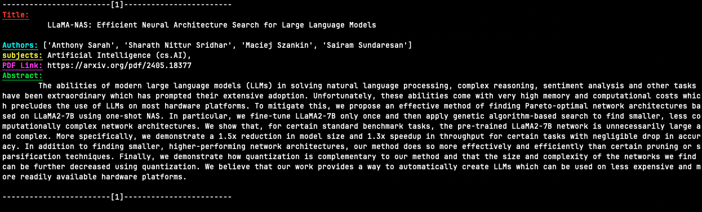

# arxiv-summary

Are you really lazy like me and hate leaving the terminal? Do you also like to keep up to date with the research in your field?

If so then you may be interested in this repository.

Arxiv-summary will download the metadata of the most recent articles of a specific field of reserach and display them in a condensed form right in your command line.

The project is in very early days yet and I aim to add much more functionality. See TODO section for future aims of project :)

## Example



## Installation Instructions

### Prerequisites

-   Python 3.11
-   `pip` python package manager

### Installation Steps

```
git clone git@github.com:Natniif/arxiv-summary.git
cd arxiv-summary
pip install
```

## Usage

```
usage: gather_articles.py [-h] --topic TOPIC [--abstract ABSTRACT] [--num NUM]
options:
  -h, --help                        show this help message and exit
  --topic TOPIC, -t TOPIC           Choose topic. use underscores instead of spaces
  --abstract ABSTRACT, -a ABSTRACT  Display the abstract. Default = True
  --num NUM, -n NUM                 Choose how many papers to display
```

E.g.
`python3 gather_articles.py --topic=artificial_intelligence --abstract=True --num=5`

## TODOs of project

-   [x] Add support for other topics
-   [ ] Add testing suite to prevent future breakage if change in website html
-   [ ] Add in an AI agent from huggingface that can summarise a paper
